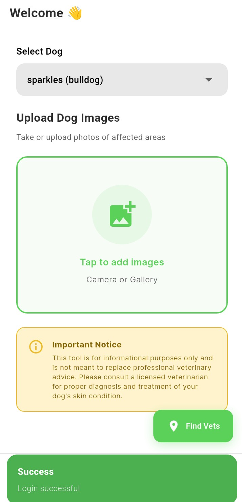
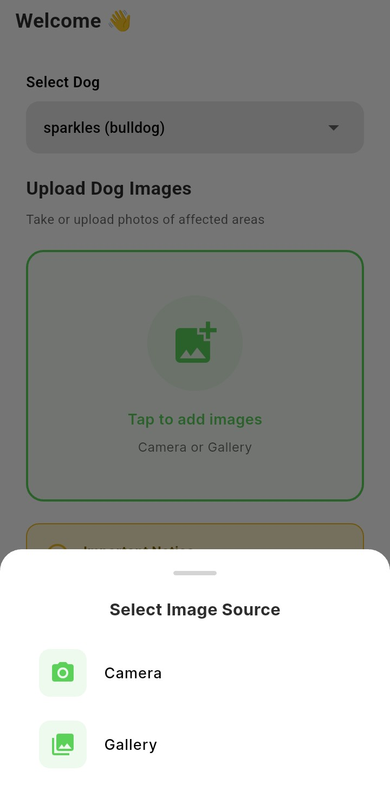
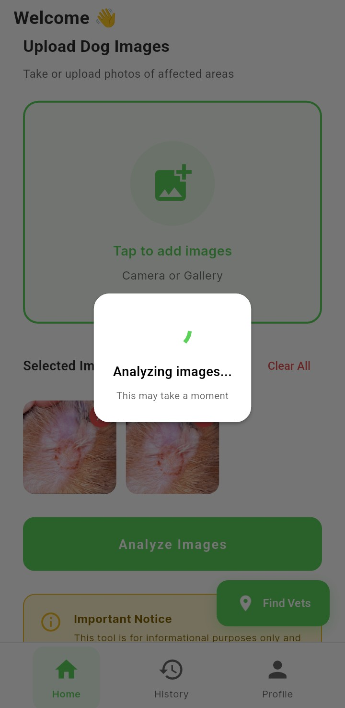
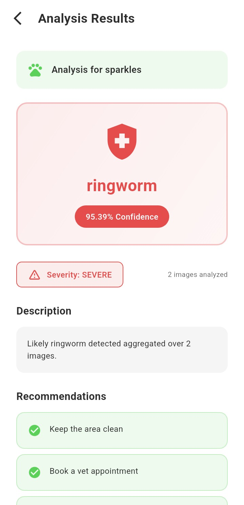
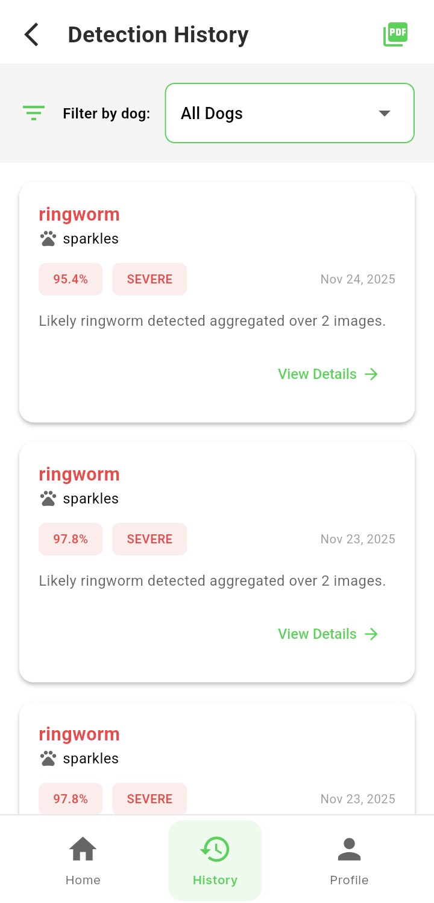

# PawScan: Dog Skin Disease Detection

A mobile application that uses computer vision to detect and classify common dog skin diseases from smartphone images. Powered by MobileNetV2 and built with Flutter.

## 🐕 About

PawScan helps pet owners and veterinarians quickly identify potential skin conditions in dogs using AI-powered image analysis. The app detects 6 common skin conditions: Healthy, Hypersensitivity, Ringworm, Fungal Infections, Demodicosis, and Dermatitis.

## 📁 Project Structure

```
PawScan/
├── api/
│   ├── main.py                  # Fast API endpoint for inference
│   └── utils.py                 # Helper functions for preprocessing and predictions
├── data/
│   └── dataset/                 # Dataset for training and evaluation
│       ├── train/               # Training images
│       ├── test/                # Test images
│       └── valid/               # Validation images
├── mobileapp/                   # Flutter mobile application
│   ├── android/                 # Android configuration files
│   ├── ios/                     # iOS configuration files
│   ├── lib/                     # Flutter/Dart source code
│   └── assets/                  # App assets (icons, images, etc.)
├── models/                      # Saved trained models
│   └── best_mobilenet_phase1.h5
├── notebooks/                   # Jupyter notebook workflows
│   ├── data_exploration.ipynb
│   ├── data_preprocessing.ipynb
│   └── test_model_architecture.ipynb
├── src/                         # ML training scripts
│   ├── config.py                # Configuration file
│   ├── data_preprocessing.py    # Functions for loading and preprocessing images
│   ├── model_architecture.py    # MobileNetV2 architecture setup
│   ├── train_model.py           # Training script
│   └── evaluate_model.py        # Model evaluation script
└── requirements.txt             # Python dependencies

```
## Installation

1. Clone the repository:
```bash
git clone https://github.com/sweenymbuvi/PawScan_Dog_Skin_Diseases_Detection
```

2. Create a virtual environment and install the requirements:
```bash
python -m venv venv
venv\Scripts\activate
pip install -r requirements.txt
```

3. Download the dataset

- [Kaggle Dog Skin Diseases Dataset](https://www.kaggle.com/datasets/youssefmohmmed/dogs-skin-diseases-image-dataset)

**Extract to:**

```bash
data/dataset/
```


## 📱 Mobile App

### Prerequisites

- Flutter SDK 3.13+
- Android Studio or Xcode
- Firebase account

### Install dependencies

```bash
cd mobileapp
flutter pub get
```

### Configure Firebase

1. Create a Firebase project  
2. Add `google-services.json` to:

```
mobileapp/android/app/
```

3. Enable **Authentication** and **Firestore**

### Run the app

```bash
flutter run
```

## 📊 Dataset

- **Source**: [Kaggle Dog Skin Diseases Dataset](https://www.kaggle.com/datasets/youssefmohmmed/dogs-skin-diseases-image-dataset)   
- **Classes**:  
  - Healthy  
  - Hypersensitivity  
  - Ringworm  
  - Fungal Infections  
  - Demodicosis  
  - Dermatitis

## 🧠 Model Training

The model uses **MobileNetV2** with transfer learning:

### Preprocessing

- Images resized to **224×224**
- Augmentation: rotation, flip, zoom, brightness
- Normalization

### Architecture

- **Base**: MobileNetV2 (ImageNet pre-trained)  
- **Custom Head**:
  - Dense 128
  - Dense 64
- **Output**: 6 classes (softmax)

### Training Process

- Phase 1: Base layers **frozen**
- Phase 2: Deeper layers **unfrozen** for fine-tuning
- Class weights used for imbalance
- Early stopping applied


## 📈 Model Performance

- **Overall Accuracy**: **90%**


## 📱 Screenshots

<p>
  
  
  
  
  
</p>


